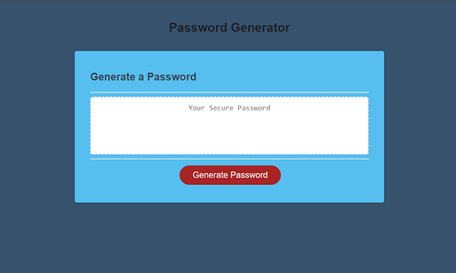

## Password Generator

This application generates a number of random characters that can be copied and used for passwords.

Through a series of prompts the user can choose how the long the password will be (8-128 characters long) which type of character/s (Uppercase, Lowercaser, Numbers and Symbols) to include and the application will generate the random password.

* If the user inputs a number less than 8 or greater than 128 an alert will notify them to input a number between 8 & 128.

* If the user inputs any character that is not a number an alert will notify them to input a valid number.

* If the user doesn't choose at least one type of character an alert will notify the user they must pick at least one character type

